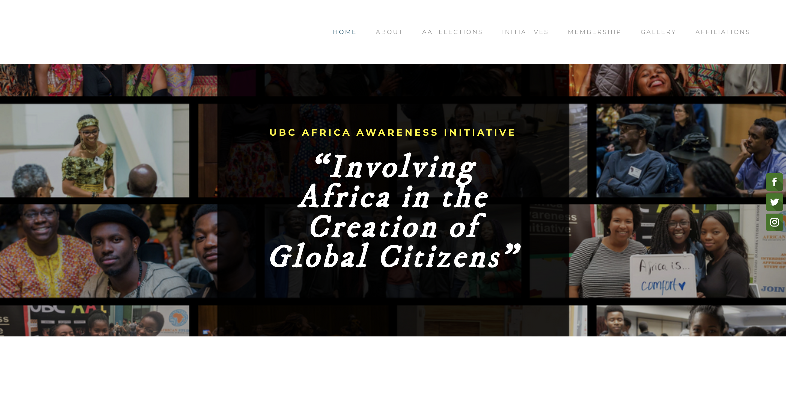
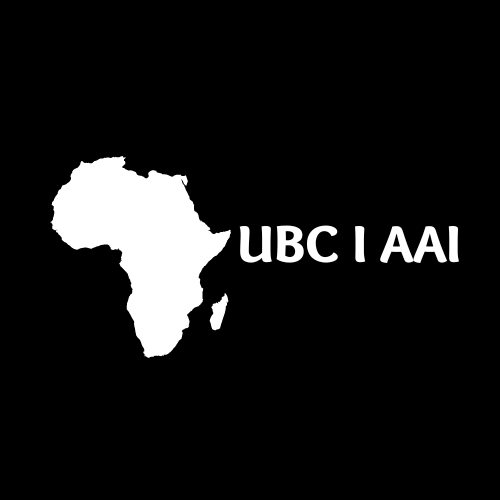

<!--
*** Thanks for checking out the ubcaai project. If you have a suggestion
*** that would make this better, please fork the repo and create a pull request
*** or simply open an issue with the tag "enhancement".
*** Don't forget to give the project a star!
-->

<!-- PROJECT LOGO -->

  
  

    <a href="http://www.ubcaai.org/">ubcaai.org</a>
  

<!-- TABLE OF CONTENTS -->

  
Table of Contents

  <ol>
    <li><a href="#about-the-project">About The Project</a></li>
    <li><a href="#built-with">Built With</a></li>
    <li><a href="#features">Features</a></li>
    <li><a href="#roadmap">Roadmap</a></li>
    <li><a href="#contributing">Contritibuting</a></li>
    <li><a href="#contact">Contact</a></li>
    <li><a href="#acknowledgments">Acknowledgments</a></li>
  </ol>

<!-- ABOUT THE PROJECT -->
## About The Project
The UBC Africa Awareness Initiative (AAI) is a student-run organization, started in 2002, committed to improving discourse surrounding and including Africa at UBC. The club currently has a basic website which is seldomly used by the members and even the executive team.There is less traffic on their current website compared to other student run clubs on UBC campus. Below is a screenshot and link to AAI's current website.

  
  

    An awesome README template for the UBC AAI Website!
     
    <a href="https://ubcaai.netlify.app/">View Demo</a>
    <a href="https://github.com/fntetteh/ubcaai">GitHub Project Link</a> 
  

My proposal is to redesign the website dynamically with more interactive features. Students would be able to easily use and navigate the proposed website because it is intuitive and interactive.

(<a href="#readme-top">back to top</a>)

## Built With

-  `HTML5`
-  `CSS3`
-  `JavaScript`
-  `Bootstrap`
-  `Netlify`

(<a href="#readme-top">back to top</a>)

<!-- Features -->
## Features
Several new and old features are incorporated into this website to as requested by the client.

This is an example of how you may give instructions on setting up your project locally.
To get a local copy up and running follow these simple example steps.

<!-- ROADMAP -->
## Roadmap

- [x] Add index.html
- [x] Structure index.html - Layout w/ navbar, footer, carousel
- [x] Add Team page
    - [x] Add contact form
- [ ] Add Events page
- [ ] Add Initiative Page
- [ ] Link all webpages

(<a href="#readme-top">back to top</a>)

<!-- CONTRIBUTING -->
## Contributing

Contributions are what make the open source community such an amazing place to learn, inspire, and create. Any contributions you make are **greatly appreciated**.

If you have a suggestion that would make this better, please fork the repo and create a pull request. You can also simply open an issue with the tag "enhancement".
Don't forget to give the project a star! Thanks again!

1. Fork the Project
2. Create your Feature Branch (`git checkout -b feature/AmazingFeature`)
3. Commit your Changes (`git commit -m 'Add some AmazingFeature'`)
4. Push to the Branch (`git push origin feature/AmazingFeature`)
5. Open a Pull Request

(<a href="#readme-top">back to top</a>)

<!-- CONTACT -->
## Contact

Felix Nuetey Tetteh: [Email](tettehfelixnuetey@gmail.com), [LinkedIn](http://linkedin.com/in/felix-nuetey-tetteh)

(<a href="#readme-top">back to top</a>)

<!-- ACKNOWLEDGMENTS -->
## Acknowledgments

Use this space to list resources you find helpful and would like to give credit to. I've included a few of my favorites to kick things off!

* [Awesome Readme Template](https://github.com/othneildrew/Best-README-Template)
* [GitHub Emoji Cheat Sheet](https://www.webpagefx.com/tools/emoji-cheat-sheet)
* [Font Awesome](https://fontawesome.com)

(<a href="#readme-top">back to top</a>)

